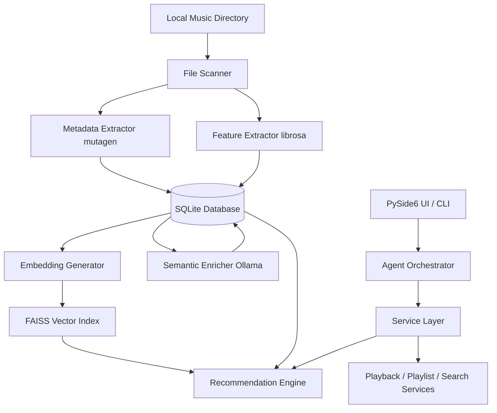

# AI-Powered Local Music Recommendation System

An intelligent, fully offline local music player and recommendation system. This application extracts acoustic descriptors, projects audio signals to dense similarity vectors, indexes them with FAISS, enriches tracks with LLM semantic annotations, and orchestrates user requests through a natural-language agent orchestrator—all running locally on CPU.

---

## Architecture Overview



---

## Key Features

1. **Local Folder Scanning & Metadata Resolution**
   - Automatically crawls folders recursively (pruning hidden directories and hidden files).
   - Extracts standard technical/tag metadata using `mutagen` for MP3, FLAC, M4A, OGG, and WAV.

2. **Handcrafted Audio Descriptor Extraction (MIR)**
   - Computes statistical summaries (mean, standard deviation, min, max, median, dynamic range) using `librosa` for:
     - MFCC (Mel-Frequency Cepstral Coefficients)
     - Chromagram (12-dim pitch energy representation)
     - Spectral Centroid & Spectral Contrast
     - RMS Energy & Zero Crossing Rate
   - Estimates musical keys using shifted Krumhansl-Schmuckler profiles.

3. **512-Dimensional Vector Projection**
   - Integrates `OpenL3` for dense musical feature projection.
   - Falls back gracefully to a deterministic random projection algorithm when OpenL3 is unavailable, preserving CPU resources and matching dimension consistency (512-dim unit-normalized).

4. **FAISS Vector Indexing**
   - Utilizes `FAISS` (`IndexIDMap` wrapping `IndexFlatIP`) to support lightning-fast Cosine Similarity searches matching the sqlite database record keys.

5. **Multi-Strategy Recommendation Engine**
   - **Vector Recommendation:** Queries the FAISS index to find nearest neighbors in the embedding space.
   - **Content-Based MIR Recommendation:** Uses statistical acoustic descriptors normalized with StandardScaler and projected using PCA to compute similarity.
   - **Hybrid Recommendation:** Linearly fuses scores from both pipelines with customizable weights.

6. **Semantic Enrichment & AI Assistant**
   - Uses local LLMs through `Ollama` to infer tags (moods, activities, themes, energy, vocal style) from audio tags.
   - **Agent Orchestrator:** An LLM-driven orchestrator translating natural-language queries (e.g., *"Play some chill rock"* or *"Generate an upbeat gym playlist"*) into structured multi-step execution plans validated against Pydantic schemas. Includes response caching and error-aware retry correction.

7. **Listening History & Playlists**
   - Tracks playback metrics (plays, skips, likes, duration, timestamps) independently of music file tags.
   - Manages manual and automated smart playlists (seed-based, search-filtered, and assistant-constructed).

8. **Non-blocking PySide6 Desktop GUI**
   - A multi-tab interface featuring:
     - **Library:** View and scan local tracks.
     - **Now Playing:** Control music playback, queue progression, and track listening stats.
     - **Recommendations:** Get similar tracks by choosing a seed song and a recommender strategy.
     - **Search:** Text search, vector search, or filter songs by semantic tags.
     - **Playlists:** Create, play, delete, or regenerate playlists.
     - **AI Assistant:** Chat panel to interact with the LLM orchestrator.
     - **Settings:** Customize indexing folders, Ollama parameters, and recommender configurations.
   - Heavily utilizes backend threads (`QThread`) to run intensive processing tasks (scanning, feature extraction, LLM indexing) without blocking the UI.

---

## Directory Structure

```text
├── app/
│   ├── assistant/      # Pydantic schemas, Ollama client, planner, executor, and chat log history
│   ├── config/         # Global application settings and path resolutions
│   ├── database/       # SQLAlchemy 2.0 schema models, connections, and migrations
│   ├── embeddings/     # OpenL3 embedding integration and projection fallbacks
│   ├── features/       # Audio descriptor extraction and key estimation (librosa)
│   ├── indexing/       # Directory scanner
│   ├── metadata/       # mutagen extractor, MusicBrainz enrichment, and Ollama semantic tags
│   ├── recommendations/# Content-based, Vector, and Hybrid recommender engines
│   ├── search/         # FAISS vector index wrapper
│   ├── services/       # Decoupled backend business services
│   ├── ui/             # PySide6 components, tabs, MainWindow, and QThread workers
│   └── utils/          # Logging configurations
├── migrations/         # Alembic database migrations
├── tests/              # Full unit, integration, and UI test suites
├── pyproject.toml      # Dependency definitions
└── README.md
```

---

## Setup & Installation

### 1. Prerequisites
- **Python:** Version `>= 3.13`
- **System Audio Utilities (Linux only):** PySide6 leverages GStreamer to play music files via QtMultimedia. Ensure you install the GStreamer backend and plugins:
  ```bash
  # Debian/Ubuntu
  sudo apt-get install libgstreamer1.0-0 gstreamer1.0-plugins-base gstreamer1.0-plugins-good gstreamer1.0-plugins-bad gstreamer1.0-plugins-ugly gstreamer1.0-libav gstreamer1.0-alsa gstreamer1.0-pulseaudio

  # Fedora
  sudo dnf install gstreamer1-plugins-base gstreamer1-plugins-good gstreamer1-plugins-bad-free gstreamer1-plugins-bad-free-extras gstreamer1-plugins-ugly-free gstreamer1-libav
  ```
- **Ollama:** Make sure Ollama is installed and running locally to support the natural language AI Assistant and semantic indexing.
  ```bash
  # Start Ollama and download a lightweight model
  ollama pull mistral
  ```

### 2. Installation
Clone the repository and install the package with development dependencies in a virtual environment:
```bash
# Create and activate a virtual environment
python3 -m venv .venv
source .venv/bin/activate

# Install the package and dependencies in editable mode
pip install -e .[dev]
```

### 3. Configuration
You can customize settings by creating a `.env` file in the project root:
```env
# Database Path
DATABASE_URL=sqlite:///data/music_rec.db

# Ollama parameters
OLLAMA_URL=http://localhost:11434/api/generate
OLLAMA_MODEL=mistral
OLLAMA_READ_TIMEOUT=120.0

# Supported formats (comma separated)
SUPPORTED_FORMATS=.mp3,.flac,.wav,.m4a,.ogg
```

### 4. Database Initialization
Verify database tables are initialized and up-to-date by running Alembic migrations:
```bash
alembic upgrade head
```

---

## Usage

The application can be driven via command-line arguments or using the Desktop GUI.

### Launching the Desktop GUI
```bash
python -m app.main gui
```

- **View or set the project LLM model:**
  ```bash
  # Check current LLM model and local Ollama status
  python -m app.main get-model

  # Change and persist the LLM model for the entire project
  python -m app.main set-model llama3

  # Alternative config syntax
  python -m app.main config set-model llama3:latest
  ```
- **Override model for a single CLI command:**
  ```bash
  python -m app.main --model llama3 enrich-semantic
  ```
- **Enrich song metadata semantics:**
  ```bash
  python -m app.main enrich-semantic [--force] [--limit <count>]
  ```
- **Record listening stats:**
  ```bash
  python -m app.main play <song_id> [--duration <seconds>]
  python -m app.main skip <song_id>
  ```
- **Like or unlike a song:**
  ```bash
  python -m app.main like <song_id> [--unlike]
  ```
- **Display song listening history:**
  ```bash
  python -m app.main show-history <song_id>
  ```


---

## Testing

Run the full pytest suite to verify scanner, metadata extraction, database models, features, FAISS search, recommendation logic, AI orchestrator, and desktop layouts:
```bash
# Run all tests
pytest

# Run specific rigorous edge-case tests
pytest tests/test_phase15_rigorous.py
```
All unit tests operate on in-memory SQLite instances or mocked file structures, leaving local assets clean.

