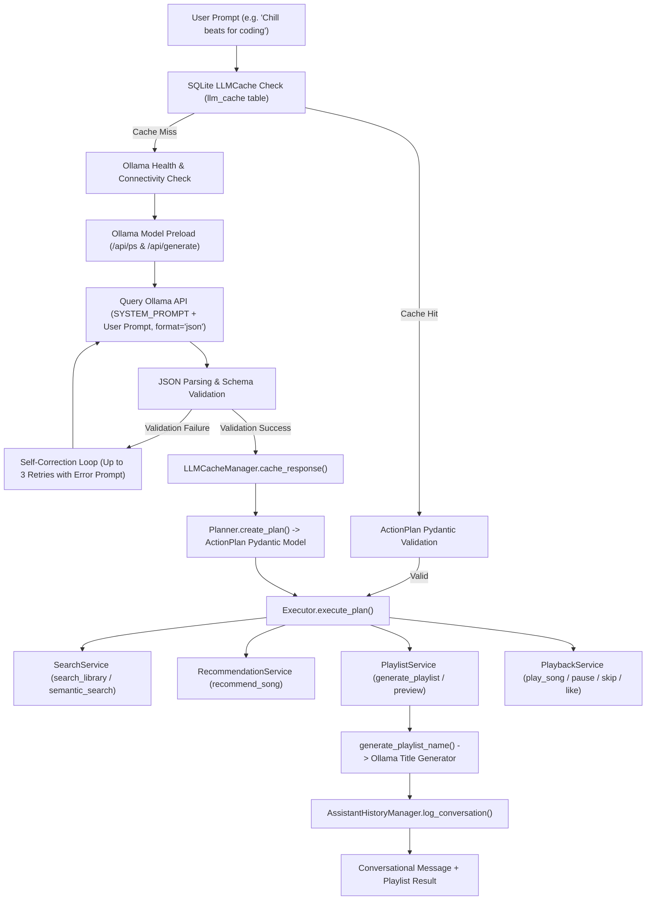

# AI Assistant Architecture

The AI Assistant subsystem translates unstructured, natural language user prompts into validated, structured action plans, executes them against the Service Layer, and generates creative playlist metadata.

---

## 1. Subsystem Architecture Overview



---

## 2. Action Schemas & Pydantic Validation (`schemas.py`)

The assistant uses Pydantic v2 discriminated unions ([app/assistant/schemas.py](file:///home/hisham/projects/music-rec/app/assistant/schemas.py#L7-L199)) to enforce strong type guarantees over LLM JSON outputs.

### Action Discriminator Schema Hierarchy
Every action item in an `ActionPlan` must contain an `action` field matching one of 18 supported action literal strings:

| Action Literal String | Pydantic Schema Class | Target Operation / Parameters |
| :--- | :--- | :--- |
| `"search_library"` | `SearchLibrary` | Text query search (`query: str`) |
| `"semantic_search"` | `SemanticSearch` | Tag filter (`moods`, `activities`, `energy_min`, `energy_max`) |
| `"recommend_song"` | `RecommendSong` | Similar items (`song_title`, `strategy`, `limit`) with auto-coercion |
| `"generate_playlist"` | `GeneratePlaylist` | Playlist creation (`playlist_name`, `strategy`, `filters`, `target_length`) |
| `"play_playlist"` | `PlayPlaylist` | Start playing playlist by name |
| `"play_song"` | `PlaySong` | Load & start playing song by title |
| `"pause"` | `Pause` | Pause active playback |
| `"resume"` | `Resume` | Resume paused playback |
| `"skip"` | `Skip` | Skip currently playing song |
| `"like_song"` | `LikeSong` | Mark song as favorite (`likes = True`) |
| `"unlike_song"` | `UnlikeSong` | Remove favorite status (`likes = False`) |
| `"shuffle_queue"` | `ShuffleQueue` | Shuffle active playback queue |
| `"repeat_queue"` | `RepeatQueue` | Toggle repeat queue mode |
| `"scan_library"` | `ScanLibrary` | Trigger folder scan (`folder_path: str`) |
| `"open_playlist"` | `OpenPlaylist` | Open playlist view by name |
| `"delete_playlist"` | `DeletePlaylist` | Delete playlist by name |
| `"save_playlist"` | `SavePlaylist` | Save current playlist draft |
| `"rename_playlist"` | `RenamePlaylist` | Rename playlist (`playlist_name`, `new_name`) |

### ActionPlan Container Schema
```python
class ActionPlan(BaseModel):
    plan: List[ActionType] = Field(..., description="Ordered list of actions to execute")
```

---

## 3. Ollama Connectivity, Health Check & Model Preloading

To ensure zero runtime crashes and instant prompt responses, `LLMParser` ([app/assistant/parser.py](file:///home/hisham/projects/music-rec/app/assistant/parser.py#L37-L126)) executes a multi-stage verification before firing parser requests:

1. **Connectivity Check**: Sends a fast HTTP GET request to the base Ollama URL (timeout: `settings.ollama_connect_timeout = 5.0s`). Raises `ConnectionError` if unreachable.
2. **Model Availability Verification**: Queries `/api/tags` to ensure the requested model (`settings.ollama_model`, e.g. `mistral`) is installed locally. Raises `ValueError` with installed model suggestions if missing.
3. **Memory Preloading**: Queries `/api/ps` to check if the model is loaded in GPU/CPU memory. If unloaded, issues a synchronous `/api/generate` preload request with `keep_alive = "20m"`.

---

## 4. Self-Correcting Error Retry Loop

LLMs occasionally output malformed JSON or miss required keys. `LLMParser` implements an automated, error-aware self-correction loop:

```python
for attempt in range(max_retries):
    try:
        response = requests.post(self.api_url, json=payload, timeout=read_timeout)
        parsed_json = json.loads(response_text)
        ActionPlan.model_validate(parsed_json)  # Pydantic validation
        return parsed_json  # Validated success!
    except ValidationError as e:
        error_details = str(e)
        retry_instruct = RETRY_PROMPT_TEMPLATE.format(error_details=error_details)
        current_prompt = f"{SYSTEM_PROMPT}\nUser: {user_prompt}\nAssistant: {response_text}\nSystem: {retry_instruct}"
```

If validation fails, the exact Pydantic `ValidationError` message is injected into the next prompt turn, prompting the LLM to inspect its previous mistake and correct the JSON structure.

---

## 5. Performance Metrics & Structured Logging

`LLMParser` captures detailed execution diagnostics for every request, logging them to `music_rec.log`:
- **Prompt Length**: Characters & estimated token count ($\approx \text{chars} / 4$).
- **Client Total Duration**: Elapsed wall-clock time in seconds.
- **Ollama Timing Metrics**:
  - `ollama_total_sec` (Total Ollama server execution time)
  - `network_overhead` ($\text{client\_duration} - \text{ollama\_total\_sec}$)
  - `ollama_load_sec` (Model load duration)
  - `ollama_prompt_eval_sec` (Prompt processing duration)
  - `ollama_eval_sec` (Token generation duration)
- **Token Generation Count & Speed**: Tokens generated per second.

---

## 6. Response Caching & Conversation History

### Response Caching (`LLMCache`)
- **Module**: [app/assistant/cache.py](file:///home/hisham/projects/music-rec/app/assistant/cache.py)
- **Table**: `llm_cache` (`prompt_hash` SHA-256 PK, `response` JSON, `created_at`).
- **Behavior**: Exact user prompts return instantly from SQLite without hitting the local LLM. If schema definitions change, invalid cached plans are automatically evicted.

### Conversation History (`AssistantHistory`)
- **Module**: [app/assistant/history.py](file:///home/hisham/projects/music-rec/app/assistant/history.py)
- **Table**: `assistant_history` (`id`, `timestamp`, `prompt`, `plan`, `result`).
- **Behavior**: Stores user prompts, raw JSON plans, and execution outcomes for auditing and UI history.

---

## 7. Creative Playlist Title & Description Generation

After selecting and validating final playlist songs, `LLMParser.generate_playlist_name()` runs an secondary LLM pass to generate atmospheric, human-curated style titles (e.g. `"Midnight Neon"`, `"Steel & Sweat"`, `"Echoes of Autumn"`) instead of generic names like `"Workout Mix"`.

If the secondary LLM pass times out or fails, Verse gracefully falls back to the user prompt title without breaking execution.
