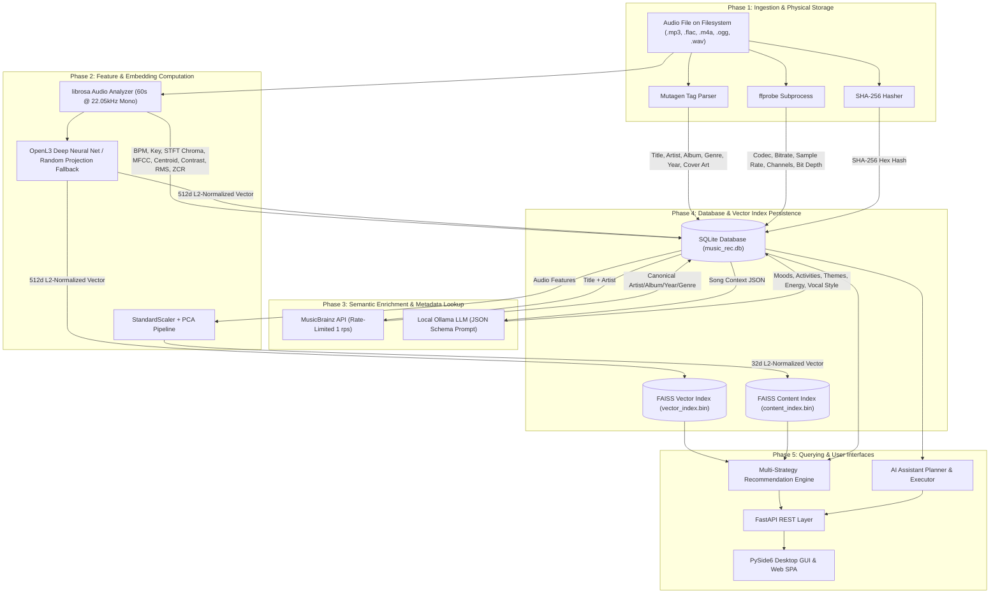

# Data Flow Architecture

This document documents the major end-to-end data pipelines in Verse, explaining data transformations, storage representations, ownership boundaries, and lifecycle stages.

---

## Data Pipeline Diagram

---

## Detailed Data Transformations by Stage

### Stage 1: File Ingestion & Identity Tracking
- **Input**: Raw audio file path on disk (e.g., `/home/user/Music/rock_track.flac`).
- **Processing**:
  1. Resolved absolute path created.
  2. SHA-256 file hash computed over 64KB file chunks.
  3. Mutagen parses ID3/FLAC/MP4/Vorbis tags.
  4. `ffprobe` JSON stream metadata parsed.
- **Output Storage**:
  - `Song` table: `path` (string, unique), `hash` (string, unique), `title`, `artist`, `album`, `duration` (float), `original_genre`, `cover_art` (BLOB).
  - `TechnicalMetadata` table: `codec`, `bitrate` (int), `sample_rate` (int), `channels` (int), `bit_depth` (int), `format`.
- **Ownership**: Written by `ScanWorker` / CLI `run_scan()`; owned by `LibraryService`.

---

### Stage 2: Acoustic Feature Extraction
- **Input**: Audio file path.
- **Processing**:
  1. `librosa.load(file_path, sr=22050, mono=True, duration=60.0)` loads first 60 seconds into a float32 NumPy array.
  2. `librosa.beat.beat_track` computes BPM tempo.
  3. `librosa.feature.chroma_stft` computes 12-dimensional pitch energy matrix. Mean chromagram vector correlated against Krumhansl-Schmuckler major/minor profiles to estimate key.
  4. `librosa.feature.mfcc` computes 13 mel-frequency cepstral coefficients.
  5. `librosa.feature.spectral_centroid`, `spectral_contrast`, `rms`, `zero_crossing_rate` computed.
- **Output Storage**:
  - `AudioFeatures` table: `bpm` (float), `chroma` (pickle BLOB), `mfcc` (pickle BLOB), `spectral_centroid` (pickle BLOB), `spectral_contrast` (pickle BLOB), `rms` (pickle BLOB), `zero_crossing_rate` (pickle BLOB), `key_estimation` (string).
- **Ownership**: Produced by `app.features.extractor`; owned by `LibraryService`.

---

### Stage 3: Embedding Generation & FAISS Indexing
- **Input**: Audio features & raw file path.
- **Processing**:
  - **OpenL3 Path**: Audio loaded at 48kHz mono -> `openl3.get_audio_embedding(content_type="music", embedding_size=512)` -> mean pooled over frames -> L2 normalized (`v / ||v||_2`).
  - **Fallback Path**: Statistical summaries (mean and standard deviation) of BPM, Chroma, MFCC, Centroid, Contrast, RMS, and ZCR concatenated into a 1D vector -> standardized -> multiplied by a fixed $80 \times 512$ Gaussian projection matrix -> L2 normalized.
- **Output Storage**:
  - `Embeddings` table: `vector` (pickled float list).
  - `FAISSIndex` (`vector_index.bin`): C++ Inner Product index storing mapping of `song_id -> 512d float32 vector`.
- **Ownership**: Owned by `FAISSIndex` and `SearchService`.

---

### Stage 4: External & Semantic Tag Enrichment
- **Input**: Song record ID, title, artist, album, genre, BPM, key, year.
- **Processing**:
  - **MusicBrainz**: Query `artist:"<artist>" AND recording:"<title>"`. Parse top recording match. Save canonical metadata to `MusicBrainzMetadata` table.
  - **Local Ollama LLM**: Construct MIR prompt -> HTTP POST to Ollama `/api/generate` -> LLM outputs JSON -> validate keys -> sanitize placeholders -> JSON serialize lists -> store in `SemanticTags` table.
- **Output Storage**: `SemanticTags` table (`moods`, `activities`, `themes`, `descriptors`, `energy`, `vocal_style`, `language`).
- **Ownership**: Owned by `enrich_song_semantics` & `enrich_song_metadata`.

---

### Stage 5: Recommendation Engine Fusion & Candidate Selection
- **Input**: Seed song ID or natural language filters, requested target length $N$, strategy name.
- **Processing**:
  1. Retrieve direct matches (`semantic_search` tags or seed song).
  2. Perform expansion: query underlying vector/content recommenders for top $2N$ candidates per seed.
  3. Validate candidate tracks semantically against filter criteria.
  4. Score candidate confidence ($C = C_{\text{base}} + 0.02 \times N_{\text{matches}}$, capped at 1.0).
  5. Apply artist diversity re-ranking to penalize back-to-back tracks from the same artist.
  6. Enforce minimum confidence threshold ($C \ge 0.85$). If candidate count $< N$, generate shortfall metadata explanation.
  7. Generate evocative creative playlist title & description via LLM (`generate_playlist_name`).
- **Output Storage**: Returned as JSON object to UI/Web API or persisted to `playlists` and `playlist_songs` tables.
- **Ownership**: Owned by `PlaylistService` & `RecommendationService`.

---

### Stage 6: Playback Event & Listening History Logging
- **Input**: Playback start/pause/complete events, user like/skip interactions.
- **Processing**:
  - Record play duration, skip counts, like toggles in `ListeningHistory` table.
  - Update active `PlaybackSession` (tracks current song index, position, and completion status).
- **Output Storage**: `listening_history` and `playback_sessions` tables.
- **Ownership**: Owned by `PlaybackService`, `HistoryService`, and `PlaybackSessionService`.
