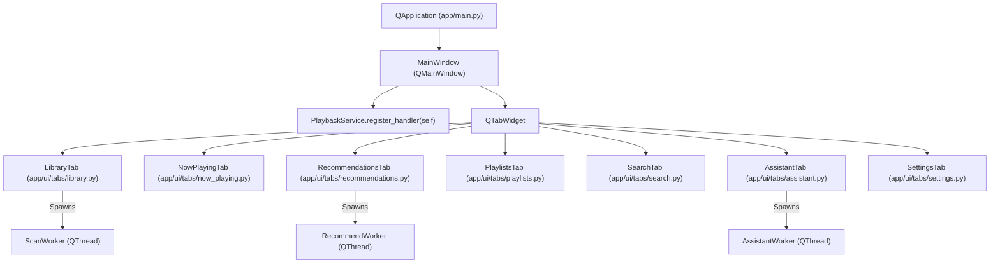

# Desktop Architecture (PySide6)

This document documents the native Desktop GUI client built with PySide6 (Qt for Python).

---

## 1. Architecture & Threading Model

The PySide6 Desktop GUI is managed by `MainWindow` ([app/ui/main_window.py](file:///home/hisham/projects/music-rec/app/ui/main_window.py)).

---

## 2. Background `QThread` Workers (`workers.py`)

Qt UI main loops must **never be blocked** by heavy I/O, audio feature extraction, vector computation, or HTTP API calls. All long-running operations execute inside background `QThread` subclasses ([app/ui/workers.py](file:///home/hisham/projects/music-rec/app/ui/workers.py)):

### A. `ScanWorker`
- **Purpose**: Runs directory scanning, metadata parsing, librosa feature extraction, OpenL3 embedding generation, and FAISS index rebuilding in a background thread.
- **Signals**:
  - `progress = Signal(int, str)`: Emits completion percentage (0–100) and current status message.
  - `finished = Signal(int)`: Emits total newly indexed/updated song count.
  - `error = Signal(str)`: Emits exception message on crash.

### B. `RecommendWorker`
- **Purpose**: Runs vector index searches and hybrid score fusion in background thread.
- **Signals**:
  - `finished = Signal(list)`: Emits list of `(Song, score)` tuples.
  - `error = Signal(str)`: Emits error message.

### C. `AssistantWorker`
- **Purpose**: Orchestrates Ollama prompt parsing, Pydantic schema validation, and plan execution in background thread.
- **Signals**:
  - `progress = Signal(str, str)`: Emits step name and status (`"running"`, `"success"`, `"error"`).
  - `playlist_generated = Signal(dict)`: Emits generated playlist preview dictionary.
  - `finished = Signal(str, list)`: Emits summary text and execution step logs.
  - `error = Signal(str)`: Emits error message.

---

## 3. Tab Structure & View Hierarchy

Each tab is implemented as a decoupled `QWidget` subclass:
- **`LibraryTab`**: Filesystem directory selection, trigger scan button, progress bar, search filter, and song list table.
- **`NowPlayingTab`**: Album cover art rendering, song metadata labels, play/pause/skip buttons, seek slider, and volume slider.
- **`RecommendationsTab`**: Target song selection dropdown, strategy selection (`Automatic`, `Vector`, `Content`, `Hybrid`), candidate count limit, recommendation results table, and "Play Recommendation" button.
- **`PlaylistsTab`**: Created playlist list, playlist details view, track list table, and export buttons.
- **`SearchTab`**: Instant search bar, metadata search results table, and vector similarity search.
- **`AssistantTab`**: Conversational prompt input, step execution log view, and playlist preview table.
- **`SettingsTab`**: Active Ollama model configuration (`mistral`, `llama3`, `gemma`), API URL settings, connection health check, and system diagnostic logs.

---

## 4. Application Cleanup & Exit Safety

When closing the desktop application, `MainWindow.closeEvent()` ensures system safety:
1. Calls `now_playing_tab.stop_and_save_progress()` to persist playing progress.
2. Checks active `QThread` workers (`ScanWorker`, `RecommendWorker`, `AssistantWorker`). If running, terminates and waits for thread completion to prevent thread join deadlocks or database corruption.
