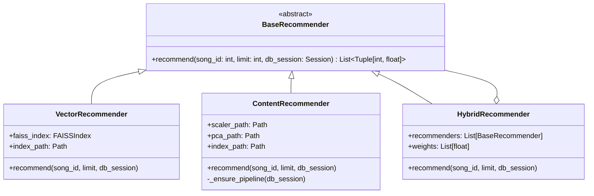
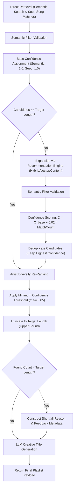

# Recommendation Engine Architecture

The Recommendation Engine is one of the foundational subsystems in Verse. It generates personalized, musically coherent recommendations using vector space similarity, classical MIR acoustic feature modeling, and hybrid score fusion.

---

## 1. Core Design & Strategy Pattern

The recommendation engine is built around the **Strategy Pattern**. All recommendation algorithms inherit from the abstract base class `BaseRecommender` defined in [app/recommendations/base.py](file:///home/hisham/projects/music-rec/app/recommendations/base.py#L7-L25).



### Base Interface Contract
- Input: `song_id` (integer primary key), `limit` (requested count), `db_session` (SQLAlchemy database session).
- Output: List of `(song_id, similarity_score)` tuples sorted in descending order of similarity score.
- Score Invariant: All similarity scores are scaled between `-1.0` and `1.0` (where `1.0` represents exact identity/maximum similarity).

---

## 2. Strategy Breakdown

### A. Vector Strategy (`VectorRecommender`)
- **Module**: [app/recommendations/vector.py](file:///home/hisham/projects/music-rec/app/recommendations/vector.py#L14-L92)
- **Concept**: Computes Cosine Similarity across 512-dimensional neural/projection audio embeddings.
- **Workflow**:
  1. Fetches the target song's binary embedding vector from the `embeddings` table in SQLite.
  2. Deserializes the vector using `pickle.loads()`.
  3. Queries the `FAISSIndex` wrapper (`vector_index.bin`) using Inner Product search for $k = \text{limit} + 1$ nearest neighbors.
  4. Filters out the target query song itself from the results.
  5. Returns top $N$ matched song IDs and similarity scores.

### B. Content Strategy (`ContentRecommender`)
- **Module**: [app/recommendations/content.py](file:///home/hisham/projects/music-rec/app/recommendations/content.py#L19-L137)
- **Concept**: Uses classical statistical MIR acoustic features (BPM, STFT Chroma, MFCCs, Spectral Centroid, Spectral Contrast, RMS Energy, Zero Crossing Rate).
- **Pipeline Architecture** ([app/recommendations/content_pipeline.py](file:///home/hisham/projects/music-rec/app/recommendations/content_pipeline.py)):
  ```text
  AudioFeatures DB Record
  ↓
  FeatureStatisticsGenerator (computes mean, std, min, max per feature)
  ↓
  FeatureVectorBuilder (constructs dense 1D NumPy vector)
  ↓
  StandardScaler (normalizes feature distributions to zero mean & unit variance)
  ↓
  PCA Transformer (reduces dimension to 32 Principal Components)
  ↓
  FAISS Content Index (content_index.bin, dim=32)
  ```
- **Rebuild Mechanism**: If scaler/PCA models or `content_index.bin` are missing, `_ensure_pipeline()` automatically queries all `AudioFeatures` in the database, fits the scaler and PCA models, and populates the 32-dimensional FAISS index.

### C. Hybrid Strategy (`HybridRecommender`)
- **Module**: [app/recommendations/hybrid.py](file:///home/hisham/projects/music-rec/app/recommendations/hybrid.py#L10-L85)
- **Concept**: Fuses candidate scores from multiple underlying recommenders using normalized linear weighted score fusion:
  $$S_{\text{hybrid}}(s) = \sum_{i=1}^{M} w_i \cdot S_i(s)$$
- **Workflow**:
  1. Normalizes weights so that $\sum w_i = 1.0$.
  2. Requests $\max(2 \times \text{limit}, 20)$ candidates from each underlying strategy to maximize candidate overlap.
  3. Multiplies returned similarity scores by respective weights and aggregates for identical target songs.
  4. Re-ranks candidates by aggregated score descending.

### D. Strategy Selector & Automatic Mode (`selector.py`)
- **Module**: [app/recommendations/selector.py](file:///home/hisham/projects/music-rec/app/recommendations/selector.py#L53-L95)
- **Automatic Fallback Logic**:
  ```text
  Check is_vector_available() AND is_content_available()
    ├─ Both Available   ──> Use "hybrid"
    ├─ Only Vector      ──> Use "vector"
    ├─ Only Content     ──> Use "content"
    └─ Neither Ready    ──> Fall back to "hybrid"
  ```
- **UI Mapping Table**:
  - `"automatic (recommended)"` / `"automatic"` $\rightarrow$ `automatic` selector
  - `"similar vibe"` / `"vector"` $\rightarrow$ `vector`
  - `"similar sound"` / `"content"` $\rightarrow$ `content`
  - `"balanced"` / `"hybrid"` $\rightarrow$ `hybrid`

---

## 3. Candidate Retrieval, Confidence Scoring & Shortfall Pipeline

When generating AI playlists via `PlaylistService.generate_playlist()`, candidate selection follows a strict multi-stage confidence pipeline:



### Base Confidence Reference Values

| Source Type | Base Confidence Score ($C_{\text{base}}$) |
| :--- | :--- |
| **Direct Semantic Match** | `1.00` |
| **Direct Seed Song Match** | `1.00` |
| **Hybrid Recommendation** | `0.95` |
| **Vector Recommendation** | `0.90` |
| **Content Recommendation** | `0.85` |

### Semantic Boost Equation
For recommendation candidates, confidence is boosted based on matching extra semantic filter criteria (moods, activities, energy):
$$C = \min\left(1.0, \, C_{\text{base}} + 0.02 \times N_{\text{semantic\_matches}}\right)$$

### Minimum Confidence Threshold Invariant
Candidates with a final confidence score $C < 0.85$ are **strictly excluded**. This guarantees that Verse never returns irrelevant or random song fillers simply to satisfy a target length request.

### Shortfall Mitigation & Feedback Metadata
If the number of confident matching songs is less than the requested target length (e.g. user requested 25 songs, but only 12 meet the $C \ge 0.85$ threshold), Verse sets `target_length` as an **upper bound** and generates clear feedback metadata:
- `requested_length`: `25`
- `found_length`: `12`
- `shortfall_reason`: `"Only 12 song(s) strongly matched your request criteria with sufficient confidence."`
- `feedback_message`: `"Found 12 high-quality match(es) matching your request (requested 25). Only these songs strongly matched your request."`

---

## 4. Extension Points for Developers

To add a new recommendation strategy to Verse:
1. Create a new class in `app/recommendations/` inheriting from `BaseRecommender`.
2. Implement the required `recommend(self, song_id, limit, db_session)` signature.
3. Register your class in `app/recommendations/registry.py`:
   ```python
   _RECOMMENDER_REGISTRY["my_strategy"] = MyNewRecommender()
   ```
4. Update strategy mapping in `app/recommendations/selector.py`.
