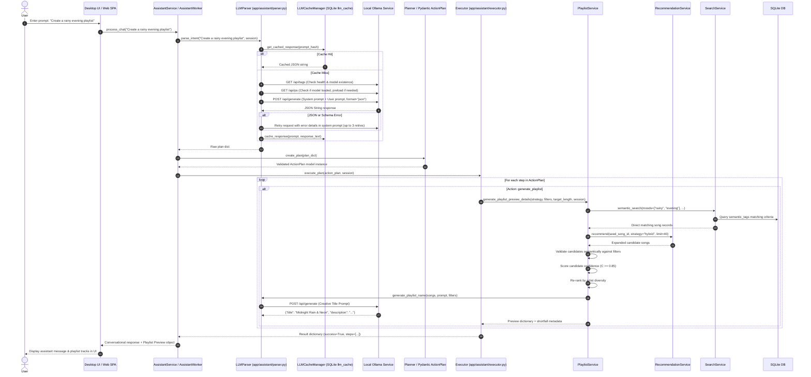
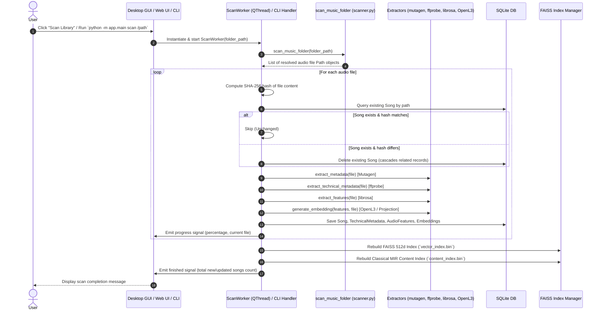
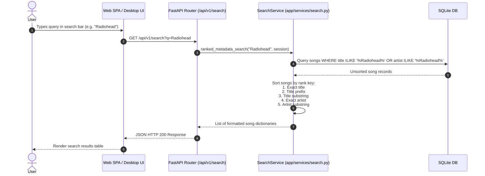
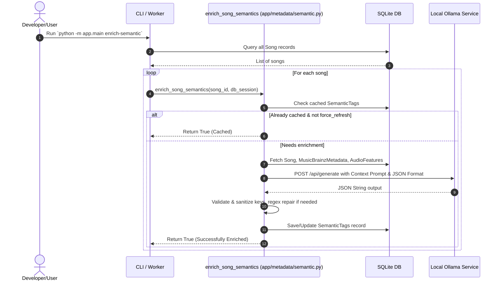
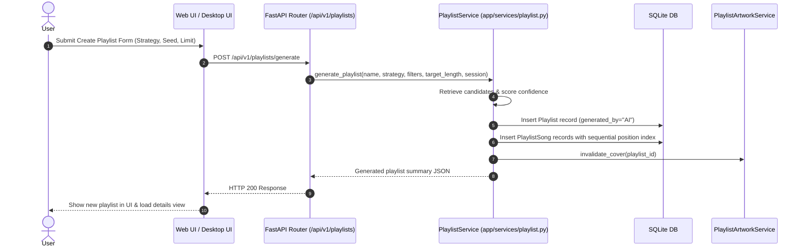
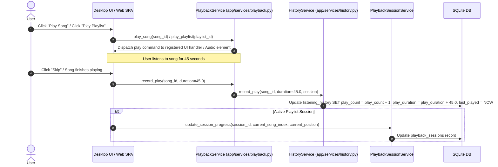
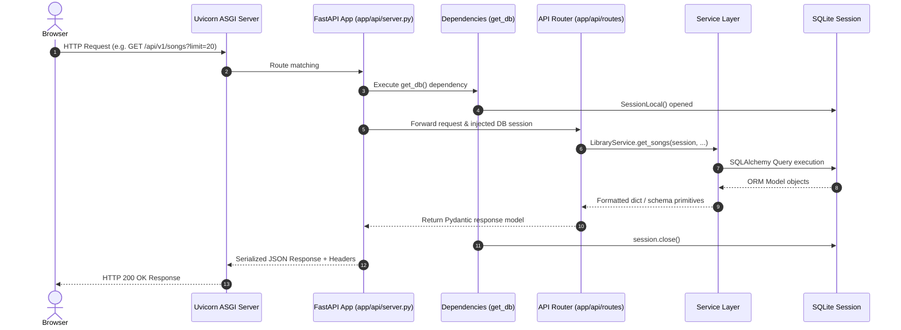
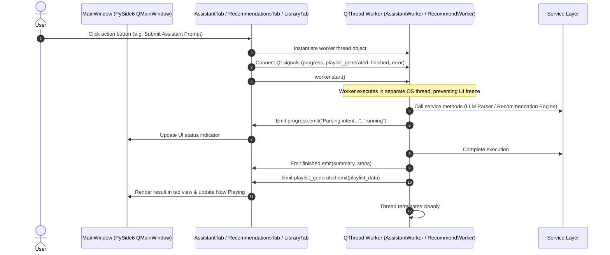

# Request Lifecycles & Sequence Diagrams

This document details the complete end-to-end execution lifecycles for major operations in Verse.

---

## Lifecycle Index

1. [AI Assistant Request Lifecycle ("Create a rainy evening playlist")](#1-ai-assistant-request-lifecycle)
2. [Music Library Scanning Lifecycle](#2-music-library-scanning-lifecycle)
3. [Metadata Search Lifecycle](#3-metadata-search-lifecycle)
4. [Semantic Tag Enrichment Lifecycle](#4-semantic-tag-enrichment-lifecycle)
5. [Playlist Creation & Persistence Lifecycle](#5-playlist-creation--persistence-lifecycle)
6. [Playback & Listening History Lifecycle](#6-playback--listening-history-lifecycle)
7. [Web HTTP REST Request Lifecycle](#7-web-http-rest-request-lifecycle)
8. [Desktop PySide6 Worker Lifecycle](#8-desktop-pyside6-worker-lifecycle)

---

## 1. AI Assistant Request Lifecycle

Example User Input: `"Create a rainy evening playlist"`

### High-Level Stage Sequence
```text
User Types Prompt -> LLM Parser (Ollama Health + Preload + JSON Generation) -> SQLite Cache Check -> Schema Validation (Planner / Pydantic ActionPlan) -> Executor -> Service Layer Orchestration -> Dynamic Candidate Retrieval -> Semantic Filtering & Confidence Scoring -> Diversity Re-ranking -> LLM Playlist Naming -> Response Returned to UI
```

### Detailed Sequence Diagram



---

## 2. Music Library Scanning Lifecycle



---

## 3. Metadata Search Lifecycle



---

## 4. Semantic Tag Enrichment Lifecycle



---

## 5. Playlist Creation & Persistence Lifecycle



---

## 6. Playback & Listening History Lifecycle



---

## 7. Web HTTP REST Request Lifecycle



---

## 8. Desktop PySide6 Worker Lifecycle


