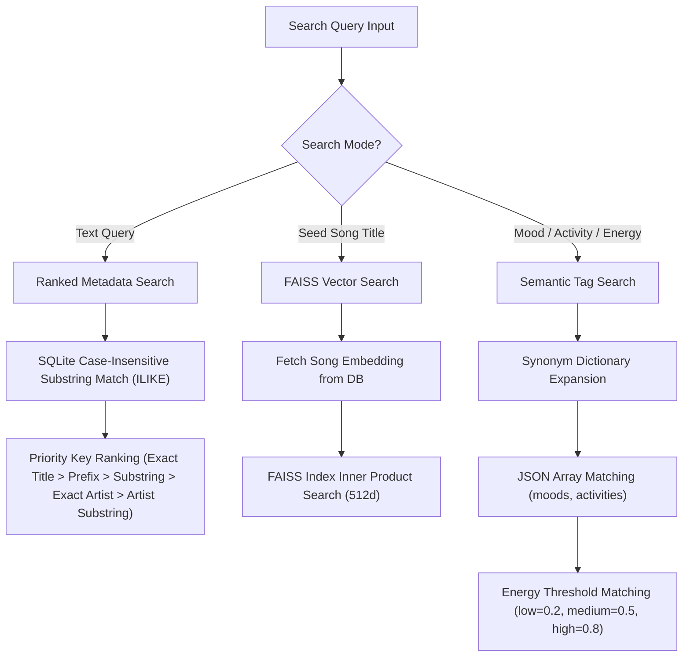

# Search Subsystem Architecture

The Search Subsystem provides unified text matching, vector similarity lookup, and semantic tag filtering across the Verse library.

---

## 1. Search Strategies Overview

Search functionality is owned by `SearchService` ([app/services/search.py](file:///home/hisham/projects/music-rec/app/services/search.py)). It provides three distinct search modes:



---

## 2. Search Mode Implementation Details

### A. Ranked Metadata Text Search (`ranked_metadata_search`)
- **Purpose**: Search for songs by user-entered text (title or artist).
- **Database Query**: `session.query(Song).filter(Song.title.ilike('%query%') | Song.artist.ilike('%query%'))`
- **Priority Ranking Algorithm**:
  ```python
  def get_rank_key(song):
      t = (song.title or "").lower().strip()
      a = (song.artist or "").lower().strip()
      if t == query_clean:       return 1, t  # Exact Title
      elif t.startswith(q_clean): return 2, t  # Title Prefix
      elif q_clean in t:          return 3, t  # Title Substring
      elif a == query_clean:       return 4, t  # Exact Artist
      elif q_clean in a:          return 5, t  # Artist Substring
      else:                       return 6, t  # Fallback
  ```
- **Returns**: List of song dicts ordered strictly by rank priority.

### B. FAISS Vector Search (`vector_search`)
- **Purpose**: Retrieve nearest acoustic/vibe neighbors to a seed song.
- **Workflow**:
  1. Resolves target seed song by title substring lookup.
  2. Retrieves vector embedding from `embeddings` table (`pickle.loads(emb.vector)`).
  3. Loads `FAISSIndex` from `data/vector_index.bin`.
  4. Calls `idx.search(vector, k=k)` to find nearest neighbors by Inner Product similarity.
  5. Returns target song records with normalized floating-point similarity scores.

### C. Semantic Tag Search (`semantic_search`)
- **Purpose**: Filter library based on high-level musical descriptors generated by Ollama.
- **Synonym Expansion Dictionary**: `SearchService` expands query terms using built-in synonym sets:
  - `"sad"` $\rightarrow$ `["sadness", "melancholic", "somber", "depressing", "gloomy", "heartbroken", "sorrowful", "tearful", "grief", "pensive", "lonely"]`
  - `"happy"` $\rightarrow$ `["happiness", "joyful", "cheerful", "upbeat", "excited", "energetic", "glad", "bright", "celebratory", "elated", "positive"]`
  - `"relaxing"` $\rightarrow$ `["relaxed", "calm", "chill", "peaceful", "soothing", "tranquil", "mellow", "serene", "meditative", "quiet", "soft", "gentle"]`
  - `"studying"` $\rightarrow$ `["study", "concentration", "focus", "work", "reading", "coding", "writing"]`
  - `"workout"` $\rightarrow$ `["gym", "running", "exercise", "training", "lifting", "cardio", "fitness", "active"]`
- **Energy Threshold Mapping**:
  - `low` $= 0.2$
  - `medium` $= 0.5$
  - `high` $= 0.8$
  - Filters using bounds `energy_min <= numeric_val <= energy_max`.

---

## 3. Database Indexes & Query Optimization

To maintain sub-millisecond search performance on SQLite:
- `songs.path`: Indexed (`index=True`)
- `songs.hash`: Indexed (`index=True`)
- `playlist_songs`: Primary Key index on `(playlist_id, song_id)`
- `playback_sessions.playlist_id`: Indexed (`index=True`)
