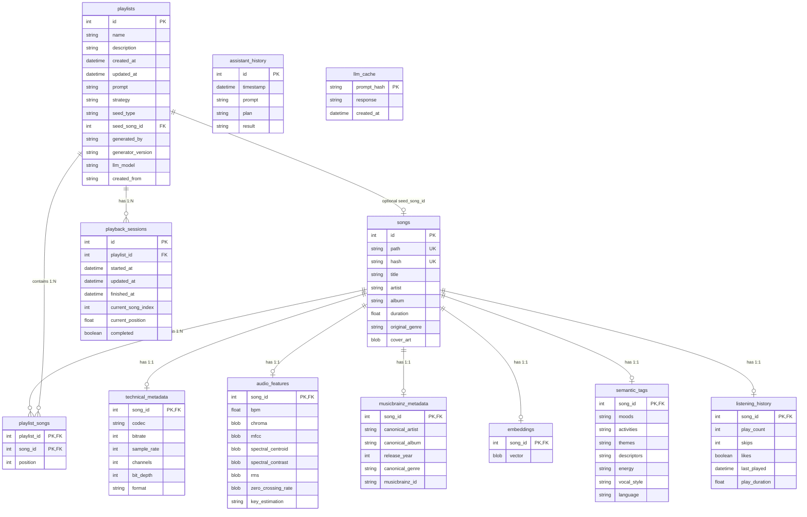

# Database Schema & Entity-Relationship Documentation

This document documents the relational database schema for Verse (`music_rec.db`), including entity relationships, indices, constraint enforcement, and cascade rules.

---

## 1. Entity-Relationship Diagram (ERD)



---

## 2. Table Specifications & Indexes

### A. Core Library Table: `songs`
- Stores primary metadata and unique file identities.
- **Indexes**:
  - `sqlite_autoindex_songs_1`: `path` UNIQUE INDEX
  - `sqlite_autoindex_songs_2`: `hash` UNIQUE INDEX

### B. Subordinate 1:1 Metadata Tables
All subordinate song metadata tables store `song_id` as both Primary Key and Foreign Key referencing `songs.id` with `ON DELETE CASCADE`:
- **`technical_metadata`**: `codec`, `bitrate`, `sample_rate`, `channels`, `bit_depth`, `format`.
- **`audio_features`**: `bpm`, `chroma` (BLOB), `mfcc` (BLOB), `spectral_centroid` (BLOB), `spectral_contrast` (BLOB), `rms` (BLOB), `zero_crossing_rate` (BLOB), `key_estimation`.
- **`musicbrainz_metadata`**: `canonical_artist`, `canonical_album`, `release_year`, `canonical_genre`, `musicbrainz_id`.
- **`embeddings`**: `vector` (Pickled float list BLOB).
- **`semantic_tags`**: `moods` (JSON string array), `activities` (JSON string array), `themes` (JSON string array), `descriptors` (JSON string array), `energy` (`low`/`medium`/`high`), `vocal_style`, `language`.
- **`listening_history`**: `play_count` (default: 0), `skips` (default: 0), `likes` (default: false), `last_played`, `play_duration` (default: 0.0).

### C. Playlist Tables
- **`playlists`**: `id` (PK autoincrement), `name`, `description`, `created_at`, `updated_at`, `prompt`, `strategy`, `seed_type`, `seed_song_id` (FK to `songs.id ON DELETE SET NULL`), `generated_by` (`MANUAL`/`AI`/`HYBRID`), `generator_version`, `llm_model`, `created_from`.
- **`playlist_songs`**: Composite PK `(playlist_id, song_id)`. `playlist_id` (FK `playlists.id ON DELETE CASCADE`), `song_id` (FK `songs.id ON DELETE CASCADE`), `position` (int).

### D. Playback & Session Tables
- **`playback_sessions`**: `id` (PK autoincrement), `playlist_id` (FK `playlists.id ON DELETE CASCADE`, indexed), `started_at`, `updated_at`, `finished_at`, `current_song_index`, `current_position`, `completed`.
- **Index**: `idx_playback_sessions_playlist_id` on `playlist_id`.

### E. AI System Tables
- **`assistant_history`**: `id` (PK autoincrement), `timestamp`, `prompt`, `plan` (JSON string), `result` (JSON string).
- **`llm_cache`**: `prompt_hash` (PK string), `response` (JSON string), `created_at`.

---

## 3. SQLite Connection Settings & Pragma Rules

SQLite requires explicit PRAGMA configuration to enforce relational invariants:
```python
@event.listens_for(Engine, "connect")
def set_sqlite_pragma(dbapi_connection, connection_record) -> None:
    cursor = dbapi_connection.cursor()
    try:
        cursor.execute("PRAGMA foreign_keys=ON")
    finally:
        cursor.close()
```
- **`PRAGMA foreign_keys=ON`**: Mandated on every new connection so that deleting a `Song` or `Playlist` automatically triggers database cascade deletions across all dependent metadata tables.
