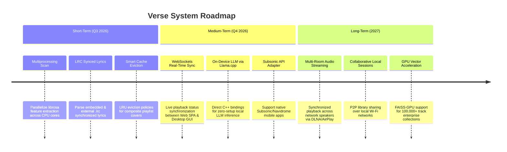

# Product & Engineering Roadmap

This document outlines the short-term, medium-term, and long-term evolutionary roadmap for Verse.

---

## 🗺️ Architectural Roadmap Summary

---

## 1. Short-Term Objectives (Q3 2026)

1. **Multiprocessing Indexing Pipeline**:
   - Implement `ProcessPoolExecutor` in `ScanWorker` to speed up CPU-bound `librosa` feature extraction by $4\times$ to $8\times$ on multi-core processors.
2. **Synchronized Lyrics Support**:
   - Parse embedded ID3 `USLT` and external `.lrc` files in `extract_metadata()`. Expose synced lyrics via `/api/v1/songs/{id}/lyrics`.
3. **Smart Cover Art Cache Management**:
   - Implement LRU eviction for cached playlist mosaic covers in `data/covers/`.

---

## 2. Medium-Term Objectives (Q4 2026)

1. **WebSockets Real-Time Playback Synchronization**:
   - Add FastAPI WebSocket endpoint `/ws/playback` to broadcast real-time play, pause, seek, and queue updates between Web SPA instances and the Desktop GUI.
2. **On-Device LLM via `llama-cpp-python`**:
   - Provide an optional embedded C++ GGUF inference engine to run LLMs without requiring a separate Ollama installation.
3. **Subsonic / Navidrome API Adapter**:
   - Implement the Subsonic API protocol (`/rest/ping`, `/rest/getMusicFolders`, `/rest/getPlaylists`) to allow third-party iOS/Android clients (e.g. DSub, Ample, Symfonium) to connect directly to Verse.

---

## 3. Long-Term Objectives (2027+)

1. **Multi-Room & Hardware Audio Streaming**:
   - Integrate AirPlay 2 and DLNA/UPnP streaming handlers into `PlaybackService`.
2. **Peer-to-Peer Local Library Sharing**:
   - Enable zero-config local network discovery (mDNS/Zeroconf) for shared recommendations across family members on the same local Wi-Fi network.
3. **GPU-Accelerated FAISS Vector Indexing**:
   - Add support for `faiss-gpu` to handle ultra-large music collections ($>100,000$ songs) with sub-millisecond vector retrieval.
