# Deployment & Operations Guide

This document covers deployment modes, persistence directory structures, daemonization, and operational maintenance for Verse.

---

## 1. Deployment Modes

Verse supports two primary deployment topologies:

```mermaid
graph TD
    subgraph Mode 1: Local Native Desktop App
        PYSIDE["PySide6 Application (python -m app.main gui)"]
        CORE1["Verse Shared Core Services"]
        SQL1["Local SQLite DB & FAISS Index Files"]
        PYSIDE --> CORE1
        CORE1 --> SQL1
    end

    subgraph Mode 2: Headless Server & Web Client
        UVICORN["Uvicorn ASGI Server (python -m app.main web)"]
        FASTAPI["FastAPI REST Layer & Web SPA"]
        CORE2["Verse Shared Core Services"]
        SQL2["Local SQLite DB & FAISS Index Files"]
        BROWSER["Web Browser Clients (Desktop / Mobile)"]
        
        BROWSER -->|HTTP / REST| UVICORN
        UVICORN --> FASTAPI
        FASTAPI --> CORE2
        CORE2 --> SQL2
    end
```



---

## 2. Directory & Persistence Layout

Verse stores state in a dedicated `data/` directory located inside the project root:

```text
data/
├── music_rec.db          # Main SQLite Relational Database
├── music_rec.log         # Application system log file
├── vector_index.bin      # FAISS 512d Inner Product similarity search index
├── content_index.bin     # FAISS 32d PCA classical MIR content index
├── content_scaler.pkl    # Serialized StandardScaler for MIR features
├── content_pca.pkl       # Serialized PCA transformer model
└── covers/               # Generated playlist composite artwork cache
```

---

## 3. Headless Server Daemonization (`systemd`)

To run the Verse FastAPI Web Server continuously on a Linux server, configure a `systemd` service unit:

### `/etc/systemd/system/verse-web.service`
```ini
[Unit]
Description=Verse AI Music Recommendation Web Server
After=network.target ollama.service

[Service]
Type=simple
User=hisham
WorkingDirectory=/home/hisham/projects/music-rec
ExecStart=/home/hisham/projects/music-rec/.venv/bin/python -m app.main web --host 0.0.0.0 --port 8000
Restart=always
RestartSec=5
Environment=LOG_LEVEL=INFO
Environment=OLLAMA_MODEL=mistral

[Install]
WantedBy=multi-user.target
```

### Enable & Start Service
```bash
sudo systemctl daemon-reload
sudo systemctl enable verse-web
sudo systemctl start verse-web
sudo systemctl status verse-web
```

---

## 4. Backups & Disaster Recovery

- **Database Backup**: Copy `data/music_rec.db`. Since SQLite uses write-ahead logging, perform online backups using the SQLite CLI:
  ```bash
  sqlite3 data/music_rec.db ".backup data/music_rec_backup.db"
  ```
- **Rebuilding FAISS Vector Indices**: If `vector_index.bin` or `content_index.bin` become corrupted or are deleted, re-running a scan restores both vector indices from embeddings in the SQLite database without requiring re-computation:
  ```bash
  python -m app.main scan /path/to/music
  ```
