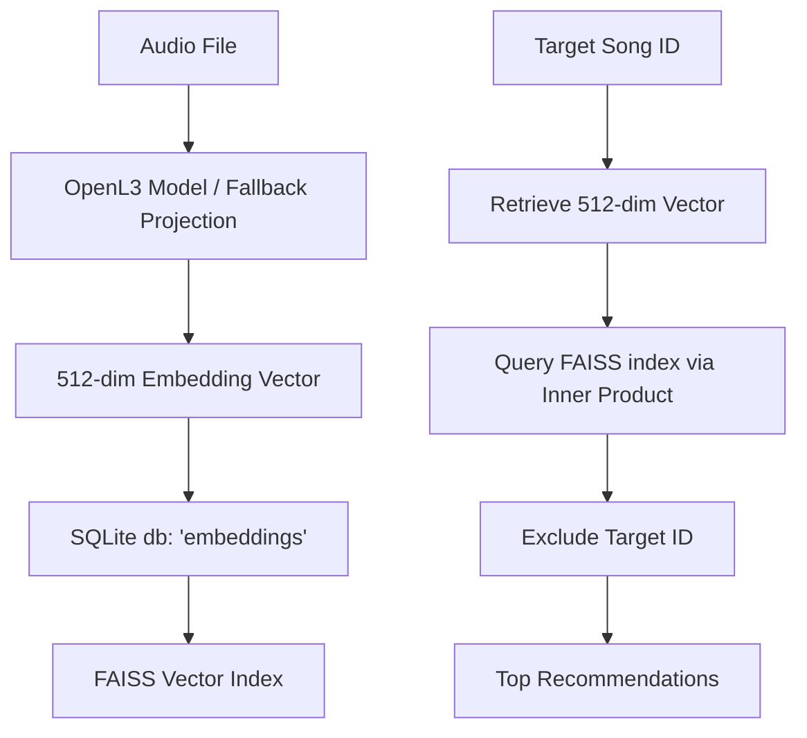
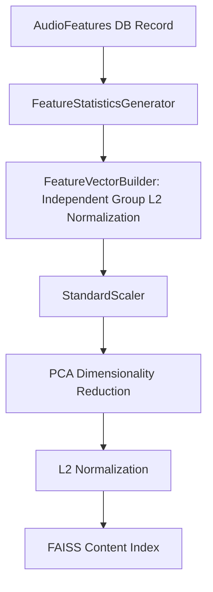
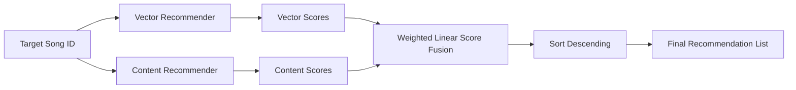

# Recommendation Strategies Overview

This document provides a technical breakdown of the three recommendation strategies implemented in the offline music recommendation system: **Vector-Based**, **Content-Based**, and **Hybrid**.

---

## 1. Comparative Summary

| Strategy | Primary Source Data | Extraction Method | Matching Engine | Best Suited For |
| :--- | :--- | :--- | :--- | :--- |
| **Vector-Based** | Raw Audio Signal | `OpenL3` Deep Neural Network (512-dim embeddings) | FAISS Index (`IndexFlatIP` Cosine Similarity) | Capturing complex semantic mood, genre patterns, and abstract musical similarities. |
| **Content-Based** | Handcrafted Audio Descriptors (MIR) | `librosa` feature statistics + StandardScaler + PCA | FAISS Index (fitted on PCA components) | Matching explicit musicological details: tempo (BPM), musical key, spectral dynamics, and timbre. |
| **Hybrid** | Score Fusion | Linear combination of Vector and Content scores | Weighted rank aggregator | Balancing abstract neural embeddings with concrete musical properties (e.g., matching moods without ignoring tempo/key). |

---

## 2. Vector-Based Recommendation (Deep Embeddings)

Vector-based recommendation relies on deep representation learning. The model projects audio signals into a dense latent space where similar sounding music sits close together.

### Key Technical Implementation Details:
* **Embedding Generation:** Tracks are projected into **512-dimensional, unit-normalized vectors**. It uses `OpenL3` (deep learning models trained on audio). If CPU resources are constrained or `OpenL3` is missing, the system falls back to a deterministic projection algorithm matching the 512-dim shape.
* **Vector Indexing:** Stored in a FAISS index (`IndexIDMap` wrapping `IndexFlatIP`). The track ID from SQLite acts as the key.
* **Distance Metric:** Because the vectors are L2-normalized, the FAISS Inner Product (`IP`) search acts as a mathematical equivalent to **Cosine Similarity** ($\cos(\theta) = A \cdot B$).
* **Query Flow:**
  1. The target song's 512-dim vector is loaded from the SQLite `embeddings` table.
  2. FAISS performs an extremely fast nearest-neighbor search using the vector.
  3. The target song is pruned from the result set, returning the top $K$ matches.

---

## 3. Content-Based Recommendation (Classical MIR)

Unlike vector search, which relies on deep learning black boxes, content-based recommendation operates directly on classical Music Information Retrieval (MIR) features. 

### Feature Processing Pipeline:
1. **Raw Feature Extraction:** Extracted using `librosa` and stored in SQLite:
   * **BPM** (Tempo)
   * **Key Estimation:** Musical key (e.g., "C Major"), encoded as a 13-dim vector (1-dim mode [1=Major, 0=Minor] + 12-dim one-hot pitch class).
   * **Spectral & Timbral Statistics:** MFCC (13-ch), Chroma (12-ch), Spectral Contrast (7-ch), Spectral Centroid (1-ch), RMS energy (1-ch), and Zero Crossing Rate (1-ch).
2. **Feature Statistics Generator:** Converts time-series features into descriptive summaries. For each feature channel, it computes 6 values along the time axis: **mean, standard deviation, median, minimum, maximum, and dynamic range**.
3. **Group-Level Normalization:** Features are grouped by family (e.g., all 78 MFCC statistics) and L2-normalized independently. This prevents high-magnitude features (like MFCC) from overwhelming lower-magnitude, yet crucial features (like RMS energy).
4. **Global Standardization:** The concatenated groups are fit and scaled via a `StandardScaler`.
5. **PCA Reduction:** Principal Component Analysis (PCA) projects the feature vector to a lower-dimensional subspace explaining **95% of the total variance** (usually around 32 dimensions).
6. **Query Flow:**
   * The target song's PCA-reduced embedding is loaded. If missing from the FAISS content index, it is recalculated on-the-fly from the database.
   * FAISS runs an inner product search on the content index, returning tracks with matching timbre, speed, and keys.

---

## 4. Hybrid Recommendation

Hybrid recommendation fuses the deep representation of the Vector strategy with the explicit musicological structure of the Content strategy.

### How the Fusion Works:
* **Candidate Expansion:** The hybrid engine queries `limit * 2` (or a minimum of 20) candidates from both the Vector and Content recommenders. Expanding the candidate pool ensures sufficient overlap for rank scoring.
* **Weighted Linear Aggregation:** The scores from both lists are combined using user-defined weights:
  $$\text{Score}_{\text{hybrid}} = (w_{\text{vector}} \times \text{Score}_{\text{vector}}) + (w_{\text{content}} \times \text{Score}_{\text{content}})$$
  *By default, the registry initializes the hybrid strategy with equal weights ($w_{\text{vector}} = 0.5$, $w_{\text{content}} = 0.5$).*
* **De-duplication & Reinforcement:** If a track is returned by both recommenders, its combined score increases. If it's only returned by one, it is still included but weighted accordingly.
* **Result Selection:** The aggregated list is sorted by the combined score in descending order and sliced to the requested limit.
